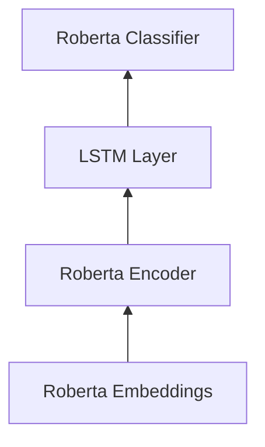

# Roberta-small-lstm

[klue/roberta-small](https://huggingface.co/klue/roberta-small)

### Model Architecture



### Sentiment Analysis Example

```diff
Input      :  한강에 가면 유독 그런 생각해요. 빠져 죽을까. 빠지면 구출 될까, 한번에 죽을까.
Prediction :  공포

Input      :  공부도 재미있고 학교 활동도 재미있었어요.
Prediction :  기쁨

Input      :  나는 순간 내가 잘못 들은 줄 알았어.
Prediction :  놀람

Input      :  사람 취급 못 받고 사는 거 같아.
Prediction :  분노

Input      :  사실 이런 생각들이 비참한 자위 같아서… 요즘은 마음이 좀 심란해요.
Prediction :  슬픔

Input      :  약도 먹어봐야 알겠지만 크게 기대는 안 하게 되는 것 같아요.
Prediction :  중립

Input      :  저게 인간이야? 잘 안 씻어서 냄새까지 나. 짐승도 저것보단 낫겠다.
Prediction :  혐오
```


### Model Evaluation


